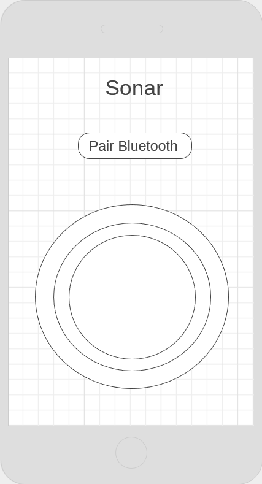

# Android and Arduino Sonar
Ziel des Projekts ist es ein Sonar zu bauen und zu programmieren,
das in einem Winkel von 180° Gegenstände erkennt. Das Projekt soll
aus dem Sonar und einer Android App, auf der die Anzeige erfolgt,
bestehen.

## Material:
- Raspberry PI
- Ultraschallsensor HC-SR04
- Servomotor

Die benötigten Komponenten sind bereits vorhanden und müssen nicht mehr beschafft werden.
Da zur Kommunikation Bluetooth eingesetz werden soll, wird ein Raspberry Pi mit integriertem Bluetooth verwendet.

## Aufbau
Der Ultraschallsensor wird am Servomotor befestigt, welcher sich
periodisch von links nach rechts dreht (180°). Die Entfernungsdaten
sollen vom Raspberry PI ausgelesen werden und drahtlos an
die Android App übertragen werden. Die Android App soll dann aus
Winkel und Entferung das entsprechende Sonar darstellen. 

Die Kommunikation zwischen der App und dem Raspberyy PI erfolgt direkt über Bluetooth. 

Einen grobes Layout der App ist in folgendem Wireframe dargestellt:

<!-- Wie werden Daten in Android angezeigt?  -->

<!-- Vielleicht kleines Mockup der App -->

## Risiken

Ein mögliches Risiko besteht in der Genauigkeit des Ultraschallsensors. Ist diese nicht hoch genug, könnete es sein, dass Objekte nur unscharf erkannt werden.

Ein weiteres Risiko ist die fehlende Erfahrung im Bereich der Android Entwicklung, weshalb die Entwicklung der App nur schwer abgeschätzt werden kann und mit einer gewissen Unsicherheit behaftet ist.

## Komplexität

Der Teil mit der höchsten Komplexität, liegt in der Berechnung und Darstelllung des Radars. 
Dabei müssen die Sensordaten des Ultraschallsensors mit dem Winkel des Servos kombiniert werden, um daraus
einen Punkt auf dem Radar abzuleiten. Anschließend muss dieser Punkt angemessen visualisert werde.

## Zeitplan

| Zeitraum | Abschnitt                         |
|----------|-----------------------------------|
|0,5 Wochen   | Setup Ultraschallsensor und Servo |
|1 Woche   | Steuerung Sonar                   |
|2 Wochen  | App und Bluetoth-Verbindung       |
|1 Woche   | Darstellung Sonar                 |
|2 Wochen   | Verfassen Paper                   |
|1 Woche    | Vorbereitung Präsentation         |

